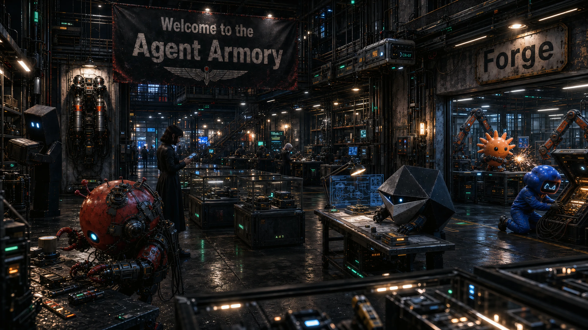

# Agent Armory

*Equipment for agents*

> [!NOTE]
> The Agent Armory is under construction. The Forge has just come online and is
> being set up to manufacture its first equipment. Check back soon to see that
> equipment in the Armory's inventory.

The Agent Armory is being built for people who want their agents to show up with
better equipment.

Good agent work is not only about the model. It also depends on the surrounding
gear: the workflow an agent follows, the facts it can trust about a harness,
the checks that keep it honest, the tools it can call, and the points where a
person stays in control. The Agent Armory is where that gear will live.

## Vision

The Armory's long-range vision is an agent experience where a person can state
intent before every criterion is known, and an adequately equipped agent can
first outfit the work: choose or assemble the right equipment, route companion
agents when needed, and use the Forge to create missing equipment before
solving the task.

That experience depends on more than skills. Equipment gives agents durable
knowledge, typed data, deterministic checks, enforceable policy boundaries,
configurable behavior, reflection loops, and loadouts that fit the task instead
of leaving every responsibility inside model context.

Read the full [Armory Vision](docs/vision.md) for the user experience and
engineering north star behind the Armory, the Forge, and Agent Equipment.

## Agent Equipment Forge

The inventory is not stocked yet. What exists now is the **Agent Equipment
Forge**: the workshop and quality system that prepares equipment before it
reaches the Armory.

The Forge helps agents turn a useful idea into something that can be trusted. It
asks what the equipment is for, which harness it will run in, where each part
belongs, what evidence backs its claims, and what must be checked before the
equipment is ready for use.

Start with the [Forge Tour](docs/forge-tour.md), or use the
[documentation map](docs/README.md) to choose a path by goal.

## What you can use now

The current value is the manufacturing setup rather than a shelf of finished
equipment.

The Forge already gives your agents a way to see how equipment is supposed to
be made, compare evidence-backed harness facts, start from templates, learn from
worked examples and planned blueprints, and run checks before treating claims as
settled. It is useful today if you want to understand how equipment will be
made, commission new equipment, or evaluate whether a future item was made with
enough discipline to trust.

> [!IMPORTANT]
> The examples and blueprints are not published agent equipment. They are
> construction material for future equipment work.

## Why this matters

A good piece of agent equipment should feel boring in the best way: the agent
knows what to do, uses the right tool, stays within the person's choices and
limits, and leaves evidence behind when it makes a claim.

That is the experience the Forge is designed to protect. It keeps repeatable
checks in tools, trusted context in docs, judgment in skills and agent profiles,
and enforceable safeguards where the harness can actually enforce them.
The Forge calls this **least cognitive privilege**: put each responsibility
where it can be handled with the least guesswork.

It also keeps claims traceable. When a harness can or cannot do something, the
docs say where that claim came from and how certain it is. The reason a
capability belongs in a skill, script, tool, or config is written down.
Equipment is not treated as ready just because it looks plausible. Safeguards,
checks, and review are part of the build process.

## The People It Serves

The Agent Armory is meant for people who wield, outfit, evaluate, procure,
commission, or keep agent equipment current through their agents. Humans choose
directions and initiate work; agents carry out the assigned work until they need
a human decision or access they do not have.

The vocabulary for the Forge names the agent roles directly:

- **Wielders:** Use equipped loadouts inside a harness.
- **Outfitters:** Assemble loadouts from equipment in the Armory.
- **Smiths:** Make equipment with the Forge.
- **Forgewrights:** Improve the Forge itself.

Wielding and outfitting are future-facing in the current repository state. The
Forge is being set up so that, once equipment is published, an outfitter can
assemble a loadout from validated items and a wielder can use that loadout with
clear expectations.

## First routes

If you are just curious, read the [Forge Tour](docs/forge-tour.md). It explains
the mission, roles, lifecycle, and future outfitting model without assuming you
already think like a harness engineer.

If you have a job in mind, use the [documentation map](docs/README.md). It
routes wielding, outfitting, evaluation, procurement, commissioning, and
equipment-care questions to the right docs.

If your agent is making equipment, start it with the
[Forge Canon](docs/agent-equipment-forge.md), the
[harness capability catalog](docs/harness-capabilities.md), and
[equipment promotion](docs/equipment-promotion.md).

## Roadmap

The first inventory items are not published yet. The current roadmap includes
these equipment lines:

- [Agent Equipment Config](specs/agent-equipment-config.md), for shared,
  layerable, enforceable configuration across equipment.
- [Issue Tracker Ops](specs/issue-tracker-ops/), for direct
  GitHub Issues bootstrap operations and future issue lifecycle equipment.
  Issue Ops is the accepted shorthand.
- [Agent Ops](specs/agent-ops.md), for repository operations performed by
  agents.
- [Periodic Actions](specs/periodic-actions.md), for recurring agent work with
  local approval and auditable state.
- [Harness Capability Refresh](specs/harness-capability-refresh.md), for keeping
  harness facts current.
- [Reflection and cognition equipment](https://github.com/nisavid/agent-armory/issues/25),
  for turning recent agent experience into durable insight, routed follow-up,
  and harness improvements after enough rudimentary engineering, operations, and
  tooling equipment exists.

The active story structure lives in the
[issue tracker](https://github.com/nisavid/agent-armory/issues). The notes under
[docs/follow-ups/](docs/follow-ups/) collect additional future equipment ideas
without presenting them as current inventory.
