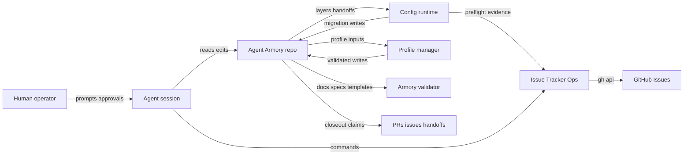

# The Agent Armory Repository Threat Model

Status: Repository Threat Model
Last refreshed: 2026-05-19

This threat model covers the Agent Armory repository, not one task or one diff.
It is the durable baseline for change-set security closeout and future
repository or change-set scans.

## Executive summary

Agent Armory is an agent-equipment repository, not a deployed web service. The
highest-risk areas are therefore not remote request handlers or tenant data
planes; they are repository-trust surfaces that future agents may use to grant
authority, mutate GitHub issues, generate hooks, expose MCP tools, apply
configuration changes, or certify equipment readiness. The most important
security objectives are preserving source-of-truth boundaries, keeping local
and secret material out of durable artifacts, making side effects explicit, and
ensuring validators do not mark unsafe equipment or stale evidence as ready.

## Scope and assumptions

In scope:

- Runtime and privileged local tools under `tools/`.
- Agent-facing policy and security docs, especially `AGENTS.md`,
  `docs/story-closeout.md`, `docs/security-and-control.md`, and this threat
  model.
- Equipment docs, specs, templates, examples, and validation surfaces that
  future Smiths, Forgewrights, Outfitters, Wielders, or agents may rely on.
- GitHub Issues state when accessed through `tools/issue_tracker_ops.py`.
- Agent Equipment Config runtime, CLI, MCP parity helpers, and migration apply
  surface in `tools/agent_equipment_config.py` and the related docs/specs.
- Harness Capability Profile Manager Core and manual refresh workflow in
  `tools/harness_capability_profiles.py`.
- Armory Integrity Validation in `tools/validate_armory_integrity.py`.

Out of scope for the current repository state:

- Internet-exposed request handling, authentication sessions, tenant data
  access, and production database compromise. The repository does not define a
  deployed network service.
- Secret-provider value resolution by Agent Equipment Config. Config records
  unresolved secret references; provider owners resolve values outside the core
  runtime.
- Enforcement by future harness adapters unless an adapter consumes the
  emitted evidence and implements a real blocking control.

Assumptions that materially affect risk:

- Agents and humans run repository tools from a trusted checkout, but branch
  content under review can be adversarial.
- GitHub Issue mutations are executed under the authenticated `gh` account
  available to the operator or agent, so wrong-repo and wrong-account mistakes
  can have public side effects.
- Templates and examples are not installed or published equipment until they
  pass the Equipment Promotion Path.
- Transient scan bundles and local paths are instance-scoped evidence; durable
  project truth belongs in committed docs, issue comments, PR bodies, or other
  approved project surfaces.
- Future equipment can become security-sensitive when it introduces execution,
  hooks, MCP/tools, permissions, credentials, scheduling, external disclosure,
  or mutation authority.

Open questions:

- Which future harness adapters will turn advisory Config or validator output
  into hard blocking controls?
- Which GitHub accounts or automation identities will normally execute
  Issue Tracker Ops mutations?
- Which future equipment surfaces will be installable outside this repository,
  and what distribution channel will carry them?

## Threat Model, Trust Boundaries, and Assumptions

### Assets

The assets that drive risk are the root policy and Forge Canon, the threat
model and security-control docs, Config layers and effective Config output,
secret references, GitHub issue state, profile refresh evidence, validators,
templates, examples, and closeout/review evidence. These are expanded in
[Assets and security objectives](#assets-and-security-objectives).

### Trust boundaries

The primary trust boundaries are human/operator input to agent sessions,
reviewed branch content to local tools, caller-supplied Config inputs to the
Config runtime, Config migration apply to the local filesystem, Config runtime
helpers to MCP surfaces, Issue Tracker Ops to GitHub Issues, manual harness
refresh artifacts to canonical profile files, and repository evidence to
external projection surfaces. These are expanded in
[Data flows and trust boundaries](#data-flows-and-trust-boundaries).

### Assumptions

The key assumptions are that the current repository has no deployed network
service, branch content can be adversarial while tools run from a trusted
checkout, GitHub mutations use the active authenticated `gh` account, Config
does not resolve secret provider values, templates/examples are not published
equipment, and transient scan artifacts are instance-scoped evidence.

### Invariants

- Archived handoff content remains provenance and does not become active
  instruction unless projected into a live Forge surface.
- Examples and specs must not claim to be installable, loadable,
  production-ready, published, or validated Agent Equipment unless they pass
  the Equipment Promotion Path.
- Harness-specific claims stay source-backed with checked dates, version basis,
  evidence category, and uncertainty.
- Mutation-capable equipment must classify side effects, permissions, secrets,
  approval requirements, rollback or cleanup behavior, and failure modes before
  promotion.
- Config mutation-capable behavior must fail closed unless effective Config is
  usable, authority is present, the source is eligible, and the chosen surface
  owns the write.
- Local-only operator choices, including machine-specific automation
  installation choices, must not be committed by default.
- Triage comments and issue records generated by AI must be marked as AI output
  and must not publish private session context, raw logs, secrets, or
  instance-scoped evidence unless disclosure has been classified and approved.
- Issue labels used as custom predicates must preserve documented cardinality
  and meaning; label drift must not silently change readiness, delegation,
  dependency, or issue-selection decisions.
- Validation tooling must not follow symlink escapes, absolute paths, `..`
  paths, URL-scheme paths, or repository-root escapes for required repo
  surfaces.
- Reportable security findings block merge-readiness until fixed, suppressed
  with evidence, or explicitly deferred by the stakeholder with risk rationale
  and tracking.

## System model

### Primary components

- **Repository policy and Forge Canon**: `AGENTS.md`, `CONTEXT.md`, and
  canonical docs under `docs/` define live agent policy, vocabulary, closeout,
  security, equipment promotion, and workflow boundaries.
- **Agent Equipment Config**: `tools/agent_equipment_config.py` loads explicit
  TOML layers and plain handoffs, composes schema fragments, produces effective
  Config, redacts secret material in CLI/MCP output, emits consumer action
  decisions, and applies registered migrations to eligible local TOML sources.
- **Issue Tracker Ops adapter**: `tools/issue_tracker_ops.py` builds GitHub
  Issues API requests, defaults live read and write operations to dry-run,
  optionally consumes Config, and uses the authenticated `gh` CLI only when
  `--execute` is set. Config preflight can refuse mutation-capable execute
  paths; read operations treat Config as advisory.
- **Harness Capability Profile Manager Core**:
  `tools/harness_capability_profiles.py` migrates, validates, summarizes,
  scouts, analyzes, plans, diffs, applies, and audits source-backed Vanilla
  Harness Capability Profiles.
- **Armory Integrity Validation**: `tools/validate_armory_integrity.py` checks
  required paths, docs, specs, templates, examples, link targets, source
  disposition, profile surfaces, and closeout readiness. It is a merge and
  external-projection gate.
- **Templates and examples**: `templates/` and `examples/` are teaching and
  scaffold surfaces. They can influence future equipment but are not published
  equipment by themselves.

### Data flows and trust boundaries

- Human/operator -> agent session: prompts, approvals, issue directives, and
  repository intent cross into the agent. Policy is `AGENTS.md` plus committed
  docs; session-local material must be classified before durable projection.
- Reviewed branch content -> local tools: Markdown, TOML, JSON, Python, and
  TypeScript files are parsed by validators and managers. Path, symlink, root
  escape, schema, and status checks are the primary controls.
- Agent Equipment Config caller -> Config runtime: caller-supplied `--layer`,
  `--plain-handoff`, `layer_paths`, fragment names, requested behavior, and
  apply authority enter the runtime. Controls include explicit-load only,
  schema validation, source category checks, trust flags, secret redaction,
  safety status, migration gates, and source precondition checks.
- Config runtime -> local filesystem: `migrate config apply` may rewrite only
  eligible local TOML sources after explicit operator or configured authority,
  trusted provenance, usable projected Config, and final precondition checks.
- Config runtime -> MCP surface: `mcp_tool_definitions()` and
  `call_mcp_tool()` expose typed parity for the safe CLI slice. Controls include
  closed-world input schemas, read/write classification, per-call authority for
  migration apply, and CLI-equivalent redaction.
- Agent or operator -> Issue Tracker Ops -> GitHub Issues: adapter commands
  construct JSON requests and invoke `gh api` only for explicit execute mode.
  Controls include dry-run defaults, argument-list subprocess invocation,
  optional Config preflight, issue-label audits, and summarized API output.
- Manual harness refresh inputs -> profile manager -> repository files:
  scout/analyze/plan/diff/apply/audit artifacts cross from evidence gathering
  into canonical profile updates. Controls include root-relative path checks,
  symlink rejection, allowed target paths, explicit effect approval, validation
  gates, and audit records.
- Repo content -> external projection surfaces: issue comments, PR bodies,
  release notes, handoffs, and review comments can publish claims externally.
  Controls include security closeout, documentation closeout, evidence
  durability classification, and review-until-clean gates.

#### Diagram

## Assets and security objectives

| Asset | Why it matters | Objective |
| --- | --- | --- |
| Root policy and Forge Canon | Agents use it to decide what is authoritative and what work may proceed. | Integrity, availability |
| Threat model and security-control docs | They guide change-set security closeout and future scans. | Integrity |
| Config layers, plain handoffs, and effective Config output | They can authorize or block mutation-capable equipment behavior. | Confidentiality, integrity |
| Secret references | They point to provider-owned secrets without storing values. | Confidentiality |
| GitHub issue state | Labels, comments, and dependencies route agent work and can notify public subscribers. | Integrity, availability |
| Profile refresh artifacts and canonical harness profiles | They shape claims about harness capabilities and future equipment surfaces. | Integrity |
| Validators and tests | They gate merge readiness and external projection claims. | Integrity |
| Templates and examples | Smiths may copy them into future hooks, scripts, MCP tools, skills, and plugins. | Integrity |
| Closeout and review evidence | Reviewers use it to accept, defer, or suppress risk. | Integrity |

## Attacker model

### Capabilities

- Submit or influence repository changes, issue comments, PR descriptions,
  handoff text, TOML/JSON/Markdown inputs, or template content that future
  agents may read.
- Provide malformed or adversarial local files to repository tools when an
  operator or agent explicitly passes those paths.
- Induce an agent to run dry-run or mutation-capable local tooling with
  attacker-selected arguments.
- Influence GitHub issue labels or comments when they have repository
  permissions, compromised credentials, or an accepted automation path.

### Non-capabilities

- Directly call a deployed Agent Armory network service. None exists in the
  current repository.
- Read secret provider values through Agent Equipment Config. The runtime
  records secret references but does not resolve providers.
- Bypass local filesystem permissions or Codex/app sandboxing without a
  separate host compromise.
- Turn a template or example into installed equipment without a future
  promotion, installation, or copy step.

## Attack Surface, Mitigations, and Attacker Stories

### Attacker-controlled inputs

Current repository validation inputs are primarily repository files in the
checked-out worktree. A malicious branch, compromised issue/PR actor, or
misleading handoff can attempt to alter Markdown, TOML, JSON, Python, and
TypeScript files parsed by local tools; path strings future agents may follow;
claimed promotion states; Config layers and plain handoffs; profile refresh
artifacts; closeout evidence; security scan summaries; issue projection text;
and label or triage records that represent readiness, triage depth, work kind,
engagement mode, brief status, dependency disposition, or rationale for agent
delegation.

### Existing mitigations

- Root `AGENTS.md` routes agents through current live Forge surfaces and treats
  archived handoff material as provenance.
- `docs/story-closeout.md` requires security closeout, documentation closeout,
  projection checks, evidence durability classification, and review gates.
- `tools/validate_armory_integrity.py` checks required paths, source
  disposition, source retirement, Markdown links, promotion-state boundaries,
  harness-profile surfaces, templates, examples, specs, and closeout surfaces.
- The validator rejects symlinked required paths and repository-root escapes
  for required live surfaces.
- `tools/agent_equipment_config.py` keeps source loading explicit, classifies
  Config Safety Status, redacts direct secret values, records secret references
  as unresolved metadata, and gates migration apply with source category,
  trust, authority, projected safety, and source precondition checks.
- `tools/issue_tracker_ops.py` defaults live read and write operations to
  dry-run output, uses `subprocess.run` with an argument list, sends JSON
  payloads on stdin, and summarizes GitHub results instead of emitting verbose
  HTTP logs.
- `tools/harness_capability_profiles.py` checks root-relative paths, rejects
  symlink escapes, constrains manual refresh writes to allowed profile targets,
  and emits reviewable plan/diff/audit artifacts.
- `docs/agents/triage-labels.md` separates labels from triage-record comments
  and instructs agents to keep private or instance-scoped evidence out of
  public tracker content.

### Attacker stories

The main attacker stories are summarized in [Top abuse paths](#top-abuse-paths).
They focus on validator bypass, unsafe Config authorization, wrong GitHub issue
mutation, profile-refresh path abuse, unsafe template promotion, and public
projection of private or stale security evidence.

### High-impact failure modes

- Active policy is hidden in archived provenance, examples, or bulky docs that
  future agents do not reliably load.
- A spec, template, or example is mistaken for installed, validated, or
  production-ready equipment.
- A validator gap marks incomplete, stale, or misleading Forge surfaces as
  ready.
- Agent Equipment Config authorizes mutation with unsafe, untrusted, stale,
  conflicted, incomplete, or direct-secret-bearing input.
- A hook, MCP/tool definition, script, Agent Profile, plugin template, or
  Config integration surface omits side-effect, permission, approval, secret,
  rollback, or failure-mode boundaries.
- A future equipment bundle grants broad filesystem, process, network, issue,
  PR, repository, or credential authority without matching controls.
- Security closeout suppresses, loses, or misstates findings without durable
  evidence and stakeholder-approved tracking.
- Issue or PR projection publishes stale SHA, stale validation status,
  sensitive local data, or incomplete security/documentation closeout claims.
- Issue Tracker Ops label drift changes agent work selection or delegation
  readiness without a corresponding triage record or audit finding.
- A tracker mutation command is run under the wrong authenticated `gh` account
  or against the wrong repository, altering public issue state or notifying
  subscribers unexpectedly.
- Reflection or cognition equipment projects private session context,
  speculative lessons, or unreviewed priority changes into durable issue,
  policy, or config surfaces without classification and routing controls.

## Entry points and attack surfaces

| Surface | How reached | Trust boundary | Notes | Evidence |
| --- | --- | --- | --- | --- |
| Armory Integrity Validation | `python3.14 tools/validate_armory_integrity.py` | Reviewed repo files -> validation decision | Reads Markdown/TOML/Python/TypeScript structure and validates path/link/status boundaries. | `tools/validate_armory_integrity.py` |
| Agent Equipment Config CLI/runtime | `tools/agent_equipment_config.py` CLI or Python import | Caller-supplied config paths/fragments -> policy decision or local migration write | Explicit-load contract; no discovery; migration apply is the only source-write path. | `tools/agent_equipment_config.py`, `docs/equipment/agent-equipment-config.md` |
| Config MCP parity helpers | `mcp_tool_definitions()` and `call_mcp_tool()` | MCP caller arguments -> typed Config operation | Closed-world schemas and per-call apply authority govern local write operation. | `tools/agent_equipment_config.py`, `specs/agent-equipment-config/mcp-tools.md` |
| Issue Tracker Ops | `tools/issue_tracker_ops.py` CLI | Local command -> authenticated GitHub API read or mutation; Config preflight gates mutation-capable operations. | Defaults reads and writes to dry-run; `--execute` crosses network/auth boundary. | `tools/issue_tracker_ops.py`, `docs/agents/issue-tracker.md` |
| Harness Capability Profile Manager Core | `tools/harness_capability_profiles.py` CLI | Scout/plan/replacement paths -> canonical profile writes | Root-relative path validation, symlink rejection, allowed mutation target checks. | `tools/harness_capability_profiles.py`, `specs/vanilla-harness-capability-profiles/` |
| Hook and script templates | Future Smith copies or adapts templates | Template guidance -> future executable equipment | Templates are non-published scaffolds but can influence future privileged surfaces. | `templates/hook/hook.ts`, `templates/script/validate-example.py` |
| Issue and PR projection text | Agent publishes comments, PR bodies, handoffs | Local evidence -> external public project state | Must avoid stale status, secrets, raw logs, or private session details. | `docs/story-closeout.md`, `docs/agents/triage-labels.md` |

## Top abuse paths

1. A malicious branch weakens validator path checks, then a future agent trusts
   a passing final-closeout run and publishes stale or unsafe equipment.
2. A Config layer or plain handoff embeds direct secret values; the runtime must
   classify the output as unsafe and redact before CLI, MCP, issue, or PR
   publication.
3. A caller passes an untrusted or generated Config layer to migration apply;
   the runtime must refuse because source category, trust, authority, or safety
   gates are not satisfied.
4. An agent runs Issue Tracker Ops against the wrong repository or account; the
   adapter must make dry-run defaults, request summaries, and Config preflight
   visible before any `gh api` mutation.
5. A profile refresh plan tries to write outside the Vanilla profile directory
   or through a symlink; the manager must reject repository-root escapes and
   non-approved mutation targets.
6. A public issue triage record publishes raw local logs, private session
   context, or speculative internal reasoning; issue policy must keep durable
   tracker content concise, classified, and AI-marked.
7. A future Smith copies a template that omits side-effect, approval, rollback,
   or secret boundaries; promotion and validation must prevent it from becoming
   published equipment.
8. A closeout comment claims security review passed while scan artifacts,
   validation, or deferred findings do not support that claim; Story Closeout
   and review gates must block merge readiness.

## Threat model table

| Threat ID | Threat source | Prerequisites | Threat action | Impact | Impacted assets | Existing controls | Gaps | Recommended mitigations | Detection ideas | Likelihood | Impact severity | Priority |
| --- | --- | --- | --- | --- | --- | --- | --- | --- | --- | --- | --- | --- |
| TM-001 | Malicious or mistaken repo change | Contributor changes validation or canonical docs; reviewer relies on validation output. | Make incomplete, stale, or unsafe equipment appear validated or published. | Future agents may grant permissions or publish unsafe equipment. | Validator, Forge Canon, templates, closeout evidence | `tools/validate_armory_integrity.py`; `docs/story-closeout.md`; security and documentation closeout policy | Validator logic is itself trusted and must be reviewed when changed. | Treat validator changes as security-sensitive; require focused tests and review for path, status, and evidence checks. | Diff scans on validator changes; final-closeout count changes; suspicious status wording churn | Medium | High | High |
| TM-002 | Malicious Config input or unsafe local layer | Agent or operator passes attacker-influenced TOML/handoff paths to Config. | Authorize mutation with unsafe, stale, untrusted, conflicted, or secret-bearing Config. | Unauthorized local config writes or downstream mutation decisions. | Config layers, effective Config, secret references | Explicit-load contract; source categories; trust flags; `safety_status`; redaction; migration authority gates | Future general authoring surfaces are not yet implemented and will need separate review. | Keep general authoring under follow-up issue scope; require plan/apply artifacts, source preconditions, and all-or-nothing writes. | Config tests; secret-boundary diagnostics; migration refusal audit records | Medium | High | High |
| TM-003 | Mistaken or compromised agent/operator | `gh` is authenticated and `--execute` is used on the wrong target or with incomplete policy. | Mutate public issue state, labels, comments, or dependencies incorrectly. | Incorrect delegation, public notifications, stale readiness, or dependency misrouting. | GitHub Issues tracker state | Dry-run default; Config preflight; `audit-labels`; JSON request summaries; triage comment policy | The current adapter cannot verify the human intent behind the authenticated account. | Keep execute explicit; include repo/issue in command summaries; prefer Config-backed mutation preflight for live runs. | Label-axis audit; issue dependency readback; unexpected issue comment or label churn | Medium | Medium | Medium |
| TM-004 | Malicious profile refresh artifact | Agent consumes an adversarial scout, analysis, replacement, or plan path. | Write outside approved profile targets or certify unsupported harness capability claims. | Misleading harness capability profile or unauthorized local file write. | Vanilla profiles, profile manager audit evidence | Root-relative path checks; symlink rejection; allowed mutation paths; validation and audit commands | First-party harness source quality varies and may be stale. | Keep checked dates, evidence class, uncertainty, and source URLs visible; rerun manager validation after refresh. | Profile diff/audit artifacts; validation failure on unsupported write targets | Medium | Medium | Medium |
| TM-005 | Future equipment author or copied template | Smith copies a scaffold into real equipment without promotion checks. | Omit side-effect classification, approval gates, rollback, or secret controls. | Overpowered future hooks, MCP tools, scripts, or skills. | Templates, examples, future equipment | Template caveats; Equipment Promotion Path; Security and Control Canon | Templates are intentionally minimal and not full implementations. | Keep templates explicit about non-published status and enforce promotion requirements before inventory. | Validator template checks; review of new equipment surfaces | Medium | Medium | Medium |
| TM-006 | Agent publishing public tracker or PR content | Closeout or triage content contains private local material or stale claims. | Publish raw logs, local paths, secrets, speculative reasoning, or unsupported security status. | Privacy leak or reviewer misdecision. | Issue comments, PR bodies, closeout evidence, Reflection Findings | Triage-record disclaimer; evidence durability classification; Story Closeout projection checks | Humans may still paste raw output manually. | Summarize instance-scoped artifacts by disposition; route Reflection Findings after disclosure classification. | Review comments; issue bodies; secret scanning; PR body checklist | Medium | Medium | Medium |

## Criticality calibration

Critical findings in this repository require a realistic path to immediate
compromise of a privileged future equipment surface, trusted artifact channel,
credential, or external control plane. Examples include pre-auth RCE in a
published MCP/tool server, a signing or distribution bypass for installable
equipment, or a Config/Issue Ops bug that directly authorizes broad external
mutation with attacker-controlled policy.

High findings involve controls that could make unsafe equipment appear ready,
publish secret values, authorize local writes across a trust boundary, or allow
Issue Tracker Ops or Config to perform mutation under unsafe policy. Validator
bypasses for promotion status, Config migration-apply gate bypasses, and MCP
tool side-effect misclassification can reach high severity.

Medium findings involve misleading or incomplete guidance that could lead to
unsafe equipment after an additional Smith, reviewer, or operator decision.
Examples include stale harness claims, weak rollback guidance, incomplete
triage records, and missing local-only evidence classification.

Low findings are clarity, consistency, or provenance issues unlikely to change
security-sensitive behavior by themselves, such as redundant non-normative
links or minor wording drift outside active policy paths.

## Focus paths for security review

| Path | Why it matters | Related Threat IDs |
| --- | --- | --- |
| `tools/validate_armory_integrity.py` | Merge-readiness and final-closeout validator; path and status checks are root controls. | TM-001, TM-005, TM-006 |
| `tools/agent_equipment_config.py` | Config parser, merge engine, redaction boundary, MCP parity, and migration write gate. | TM-002 |
| `tools/issue_tracker_ops.py` | Authenticated GitHub mutation boundary and Config preflight consumer. | TM-003 |
| `tools/harness_capability_profiles.py` | Manual refresh path validation and canonical profile write boundary. | TM-004 |
| `docs/story-closeout.md` | Required security, documentation, review, and projection gate order. | TM-001, TM-006 |
| `docs/security-and-control.md` | Canonical guidance for permissions, mutation gates, secrets, hooks, MCP/tools, and examples. | TM-002, TM-005 |
| `docs/equipment/agent-equipment-config.md` | Human-facing Config runtime and security boundary. | TM-002 |
| `docs/equipment/agent-equipment-config-integration.md` | Integration guidance for Smiths, Wielders, Outfitters, and consuming equipment. | TM-002, TM-005 |
| `specs/agent-equipment-config/` | Blueprint and MCP/edit/security/validation contracts for Config. | TM-002 |
| `docs/agents/issue-tracker.md` and `docs/agents/triage-labels.md` | Tracker mutation policy, AI-generated triage records, and label-axis semantics. | TM-003, TM-006 |
| `templates/` | Scaffolds that future Smiths may copy into real equipment. | TM-005 |

## Quality check

- Runtime surfaces, local tooling, templates, docs, examples, tests, and
  external projection surfaces are separated.
- Every discovered trust boundary is represented in the threat table or abuse
  paths.
- The model does not assume internet exposure, tenant data, or deployed server
  behavior that the repository does not currently provide.
- Open deployment and automation-account questions are stated explicitly.
- Existing controls are tied to repo paths and component responsibilities.
